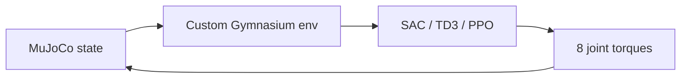

# ObstacleAnt

MuJoCo의 Ant 환경을 변형해 평지와 계단형 장애물에서 사족 보행 policy를
학습하고, SAC·TD3·PPO 알고리즘을 비교할 수 있도록 만든 강화학습
프로토타입입니다.

## 프로젝트 목표

기본 Ant locomotion 문제를 그대로 사용하는 대신 로봇 모델과 장애물 환경을
직접 수정하고, 관찰 공간·보상 함수·policy network가 장애물 통과 행동에
미치는 영향을 실험했습니다.

## 구현 내용

- 8개 관절 torque를 연속 action으로 사용하는 custom Ant 모델
- 몸통 자세, 관절 위치와 속도로 구성된 27차원 기본 observation
- 전진 속도와 생존 보상에서 제어 비용을 차감하는 reward
- 평지용 `customant`와 계단형 장애물용 `customant_stairs` 환경
- Stable-Baselines3 기반 SAC, TD3, PPO 학습 및 checkpoint 저장
- TensorBoard 학습 로그와 저장된 model을 이용한 MuJoCo 시각화



## 기술 스택

- Python
- Gymnasium / MuJoCo
- Stable-Baselines3
- PyTorch
- TensorBoard

## 실행

Python 가상환경을 만든 뒤 MuJoCo, Gymnasium, Stable-Baselines3, PyTorch를
설치합니다. 코드에는 lock file이 없으므로 호환되는 버전을 별도로 고정하는
것을 권장합니다.

```bash
python -m venv .venv
source .venv/bin/activate
pip install gymnasium[mujoco] stable-baselines3 torch tensorboard
```

`customant/customant.py`와 `customant_stairs/customant_stairs.py`의
`xml_file` 기본값은 당시 개발 환경의 절대 경로를 가리킵니다. 실행 전
각 파일에서 함께 제공된 XML의 경로로 변경해야 합니다.

```bash
# 학습: 25,000 step 단위 checkpoint를 최대 20회 저장
python main.py SAC --train
python main.py TD3 --train
python main.py PPO --train

# 저장된 checkpoint 시각화 (예: models/SAC_500000.zip)
python main.py SAC --test SAC_500000
```

## 저장소 구조

| 경로 | 내용 |
|---|---|
| `main.py` | SAC·TD3·PPO 학습/평가 entry point |
| `run.py` | 동적 Stable-Baselines3 algorithm 선택을 사용한 초기 실험 |
| `customant/` | 평지 custom Gymnasium 환경과 MuJoCo XML |
| `customant_stairs/` | 계단형 장애물 환경과 XML |

## 실험에서 배운 점

- 평지에서 빠르게 전진하는 policy가 장애물에서도 그대로 일반화되지는
  않았습니다.
- 환경 geometry뿐 아니라 observation과 reward가 회피·등반 행동을
  유도하도록 함께 설계되어야 했습니다.
- 서로 다른 높이와 형태의 장애물을 무작위화하면 특정 코스에 대한
  과적합을 줄일 수 있다는 후속 방향을 얻었습니다.

## 현재 상태와 한계

이 저장소는 2024년 강화학습 실험을 보존한 연구용 프로토타입입니다.
학습 model과 정량 결과는 저장소에 포함되어 있지 않으며, dependency와
경로 설정도 재현 가능한 package로 정리되기 전 단계입니다.

라이선스는 [LICENSE](LICENSE)를 참고하세요.
